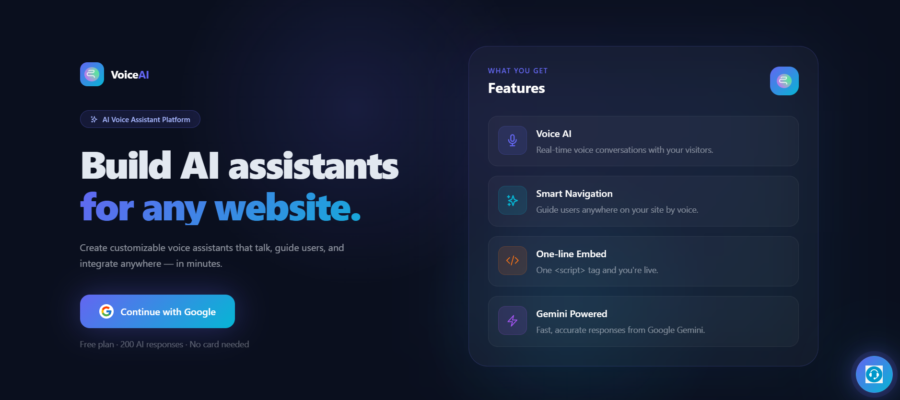
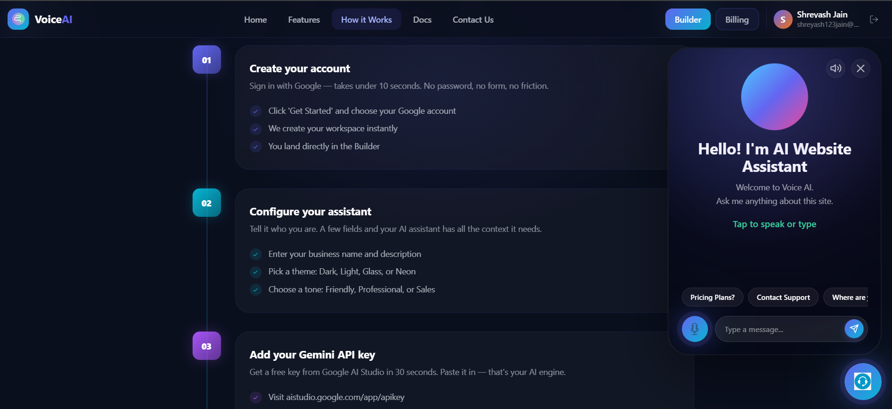
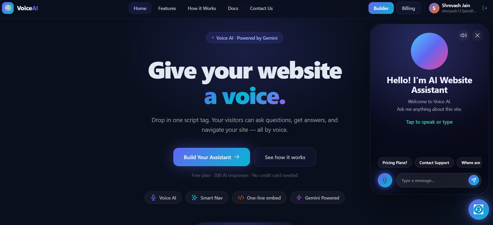

<div align="center">


# VoiceAI — AI Voice Assistant for Websites

**Add a smart voice assistant to any website with a single script tag.**  
Powered by Google Gemini · Built with React + Node.js


</div>





## 📋 Table of Contents

- [About the Project](#-about-the-project)
- [Tech Stack](#-tech-stack)
- [Project Structure](#-project-structure)
- [Prerequisites](#-prerequisites)
- [Getting Started](#-getting-started)
  - [1. Clone the Repository](#1-clone-the-repository)
  - [2. Set Up the Backend](#2-set-up-the-backend)
  - [3. Set Up the Frontend (frontend)](#3-set-up-the-frontend-frontend)
  - [4. Configure Firebase](#4-configure-firebase)
  - [5. Configure Razorpay](#5-configure-razorpay)
  - [6. Configure Gemini API](#6-configure-gemini-api)
  - [7. Run the Project](#7-run-the-project)
- [Environment Variables Reference](#-environment-variables-reference)
- [Embedding the Widget](#-embedding-the-widget)
- [Pages Overview](#-pages-overview)
- [API Endpoints](#-api-endpoints)
- [Deployment](#-deployment)
- [Contributing](#-contributing)
- [License](#-license)
- [Contact](#-contact)

---

## 🧠 About the Project

**VoiceAI** lets you embed a fully customizable AI voice assistant on any website with one `<script>` tag. Visitors can speak naturally to the assistant — it answers questions about your business and navigates users to the right page, all powered by Google Gemini.

**Key highlights:**
- 🎙️ Real-time voice input via Web Speech API
- 🤖 AI responses powered by Google Gemini
- 🎨 4 built-in themes: Dark, Light, Glass, Neon
- 🗺️ Smart page navigation — the assistant redirects users by voice command
- 💳 Free tier (200 messages) + Pro plan via Razorpay
- 🔐 Google OAuth login via Firebase
- 📦 Single `<script>` tag embed — works on any HTML page

---

## 🛠 Tech Stack

| Layer | Technology |
|---|---|
| **Frontend** | React 18, Vite, Tailwind CSS, React Router v6 |
| **Backend** | Node.js, Express.js |
| **Database** | MongoDB (Mongoose) |
| **Authentication** | Firebase Google OAuth |
| **AI Engine** | Google Gemini API |
| **Payments** | Razorpay |
| **Widget** | Vanilla JS + CSS (no framework) |
| **Deployment** | Vercel (frontend) · Railway / Render (backend) |

---

## 📁 Project Structure

```
voiceai/
│
├── frontend/                        # React frontend (Vite)
│   ├── public/
│   │   ├── assistant.js           # Embeddable widget script
│   │   ├── assistant.css          # Widget styles
│   │   ├── mic.svg                # Mic icon used in widget
│   │   └── logo.png               # Logo used in widget
│   │
│   ├── src/
│   │   ├── assets/
│   │   │   └── logo.png
│   │   │
│   │   ├── Components/
│   │   │   ├── Navbar.jsx
│   │   │   ├── ProtectedRoute.jsx
│   │   │   └── AssistantPreview.jsx
│   │   │
│   │   ├── pages/
│   │   │   ├── Home.jsx
│   │   │   ├── Login.jsx
│   │   │   ├── Builder.jsx
│   │   │   ├── Billing.jsx
│   │   │   ├── Features.jsx
│   │   │   ├── HowItWorks.jsx
│   │   │   ├── Docs.jsx
│   │   │   └── Contact.jsx
│   │   │
│   │   ├── utils/
│   │   │   └── firebase.js        # Firebase config
│   │   │
│   │   ├── App.jsx
│   │   └── main.jsx
│   │
│   ├── .env                       # Frontend env variables
│   ├── index.html
│   ├── vite.config.js
│   ├── tailwind.config.js
│   └── package.json
│
├── backend/                        # Express backend
│   ├── controllers/
│   │   ├── authController.js
│   │   ├── userController.js
│   │   ├── assistantController.js
│   │   └── billingController.js
│   │
│   ├── models/
│   │   └── User.js
│   │
│   ├── routes/
│   │   ├── auth.js
│   │   ├── user.js
│   │   ├── assistant.js
│   │   └── billing.js
│   │
│   ├── middleware/
│   │   └── authMiddleware.js
│   │
│   ├── .env                       # Backend env variables
│   ├── backend.js
│   └── package.json
│
├── screenshots/                   # 📷 Add your screenshots here
│   ├── home.png
│   ├── login.png
│   ├── builder.png
│   ├── billing.png
│   ├── features.png
│   ├── how-it-works.png
│   ├── docs.png
│   ├── contact.png
│   └── widget.png
│
└── README.md
```

---

## ✅ Prerequisites

Make sure you have the following installed before you begin:

| Tool | Minimum Version | Download |
|---|---|---|
| **Node.js** | v18.0.0+ | [nodejs.org](https://nodejs.org) |
| **npm** | v9.0.0+ | Comes with Node.js |
| **MongoDB** | v6.0+ (local) or MongoDB Atlas | [mongodb.com](https://mongodb.com) |
| **Git** | Any recent version | [git-scm.com](https://git-scm.com) |

You will also need accounts on:

- [Firebase Console](https://console.firebase.google.com) — for Google login
- [Google AI Studio](https://aistudio.google.com/app/apikey) — for Gemini API key
- [Razorpay Dashboard](https://dashboard.razorpay.com) — for payments (Test mode is free)

---

## 🚀 Getting Started

### 1. Clone the Repository

```bash
git clone https://github.com/your-username/voiceai.git
cd voiceai
```

---

### 2. Set Up the Backend

#### 2a. Navigate to the backend folder

```bash
cd backend
```

#### 2b. Install dependencies

```bash
npm install
```

#### 2c. Create the `.env` file

```bash
cp .env.example .env
# or manually create backend/.env
```

Paste the following into `backend/.env` and fill in your values:

```env
# ─── backend ──────────────────────────────
PORT=8000
NODE_ENV=development

# ─── MongoDB ─────────────────────────────
# Option 1: Local MongoDB
MONGO_URI=mongodb://localhost:27017/voiceai

# Option 2: MongoDB Atlas (recommended for production)
# MONGO_URI=mongodb+srv://<username>:<password>@cluster0.xxxxx.mongodb.net/voiceai

# ─── Session / JWT ───────────────────────
JWT_SECRET=your_super_secret_jwt_key_change_this_in_production
SESSION_SECRET=your_session_secret_key

# ─── Razorpay ────────────────────────────
RAZORPAY_KEY_ID=rzp_test_xxxxxxxxxxxxxxxxxx
RAZORPAY_KEY_SECRET=xxxxxxxxxxxxxxxxxxxxxxxx

# ─── frontend URL (for CORS) ───────────────
frontend_URL=http://localhost:5173
```

> 💡 **MongoDB Atlas (free tier):** Go to [cloud.mongodb.com](https://cloud.mongodb.com), create a free cluster, then copy the connection string into `MONGO_URI`.

---

### 3. Set Up the Frontend (frontend)

#### 3a. Navigate to the frontend folder

```bash
cd ../frontend
```

#### 3b. Install dependencies

```bash
npm install
```

#### 3c. Create the `.env` file

```bash
cp .env.example .env
# or manually create frontend/.env
```

Paste the following into `frontend/.env`:

```env
# ─── API URL ─────────────────────────────
VITE_backend_URL=http://localhost:8000
VITE_frontend_URL=http://localhost:5173

# ─── Razorpay ────────────────────────────
VITE_RAZORPAY_KEY_ID=rzp_test_xxxxxxxxxxxxxxxxxx

# ─── Firebase ────────────────────────────
VITE_FIREBASE_API_KEY=AIzaSy...
VITE_FIREBASE_AUTH_DOMAIN=your-project.firebaseapp.com
VITE_FIREBASE_PROJECT_ID=your-project-id
VITE_FIREBASE_STORAGE_BUCKET=your-project.appspot.com
VITE_FIREBASE_MESSAGING_SENDER_ID=123456789012
VITE_FIREBASE_APP_ID=1:123456789012:web:abcdef123456
```

---

### 4. Configure Firebase

Firebase is used for **Google OAuth login**.

#### Step-by-step:

1. Go to [Firebase Console](https://console.firebase.google.com) and click **"Add project"**
2. Name it `voiceai` (or anything you like) and click through the setup wizard
3. In your project dashboard, click **"Web"** (`</>`) to add a web app
4. Copy the config object — it looks like this:
   ```js
   const firebaseConfig = {
     apiKey: "AIzaSy...",
     authDomain: "your-project.firebaseapp.com",
     projectId: "your-project-id",
     storageBucket: "your-project.appspot.com",
     messagingSenderId: "123456789012",
     appId: "1:123456789012:web:abcdef123456"
   };
   ```
5. Paste each value into the corresponding `VITE_FIREBASE_*` variable in `frontend/.env`
6. In Firebase, go to **Authentication → Sign-in method → Google** and click **Enable**
7. Add `http://localhost:5173` to the **Authorised domains** list

#### `frontend/src/utils/firebase.js`

```js
import { initializeApp } from "firebase/app";
import { getAuth, GoogleAuthProvider } from "firebase/auth";

const firebaseConfig = {
  apiKey:            import.meta.env.VITE_FIREBASE_API_KEY,
  authDomain:        import.meta.env.VITE_FIREBASE_AUTH_DOMAIN,
  projectId:         import.meta.env.VITE_FIREBASE_PROJECT_ID,
  storageBucket:     import.meta.env.VITE_FIREBASE_STORAGE_BUCKET,
  messagingSenderId: import.meta.env.VITE_FIREBASE_MESSAGING_SENDER_ID,
  appId:             import.meta.env.VITE_FIREBASE_APP_ID,
};

const app      = initializeApp(firebaseConfig);
export const auth     = getAuth(app);
export const provider = new GoogleAuthProvider();
```

---

### 5. Configure Razorpay

Razorpay handles the **Pro plan payment** (₹699 / 3 months).

#### Step-by-step:

1. Sign up at [dashboard.razorpay.com](https://dashboard.razorpay.com)
2. Go to **Settings → API Keys → Generate Test Key**
3. Copy the **Key ID** and **Key Secret**
4. Add them to both `.env` files:
   - `backend/.env` → `RAZORPAY_KEY_ID` and `RAZORPAY_KEY_SECRET`
   - `frontend/.env` → `VITE_RAZORPAY_KEY_ID`
5. Add the Razorpay script to `frontend/index.html` inside `<head>`:

```html
<script src="https://checkout.razorpay.com/v1/checkout.js"></script>
```

> ⚠️ **Test mode:** Use keys starting with `rzp_test_` during development. Switch to `rzp_live_` for production.

---

### 6. Configure Gemini API

Each user provides their **own** Gemini API key in the Builder. No project-level key needed.

To test the assistant:

1. Visit [aistudio.google.com/app/apikey](https://aistudio.google.com/app/apikey)
2. Click **"Create API key"** — it's free
3. In the app, go to **Builder → Gemini API Key** and paste it

The key is saved encrypted in MongoDB and used backend-side for generating responses.

---

### 7. Run the Project

Open **two terminal windows** side by side.

#### Terminal 1 — Start the backend backend

```bash
cd backend
npm run dev
# backend starts at http://localhost:8000
```

#### Terminal 2 — Start the frontend

```bash
cd frontend
npm run dev
# App opens at http://localhost:5173
```

#### ✅ Verify everything is working

| URL | What you should see |
|---|---|
| `http://localhost:5173` | VoiceAI home page |
| `http://localhost:5173/login` | Google login screen |
| `http://localhost:8000/api/user/current-user` | `{ message: "Unauthorized" }` (expected — not logged in) |

---

## 🔑 Environment Variables Reference

### `backend/.env`

| Variable | Required | Description |
|---|---|---|
| `PORT` | ✅ | Port the Express backend runs on (default: `8000`) |
| `NODE_ENV` | ✅ | `development` or `production` |
| `MONGO_URI` | ✅ | MongoDB connection string |
| `JWT_SECRET` | ✅ | Secret key for signing JWTs — use a long random string |
| `SESSION_SECRET` | ✅ | Secret key for express-session |
| `RAZORPAY_KEY_ID` | ✅ | Razorpay Key ID (test or live) |
| `RAZORPAY_KEY_SECRET` | ✅ | Razorpay Key Secret |
| `frontend_URL` | ✅ | Frontend URL for CORS (`http://localhost:5173` in dev) |

### `frontend/.env`

| Variable | Required | Description |
|---|---|---|
| `VITE_backend_URL` | ✅ | Backend URL (`http://localhost:8000` in dev) |
| `VITE_frontend_URL` | ✅ | Frontend URL (`http://localhost:5173` in dev) |
| `VITE_RAZORPAY_KEY_ID` | ✅ | Razorpay Key ID (same as backend — test or live) |
| `VITE_FIREBASE_API_KEY` | ✅ | Firebase web app API key |
| `VITE_FIREBASE_AUTH_DOMAIN` | ✅ | Firebase auth domain |
| `VITE_FIREBASE_PROJECT_ID` | ✅ | Firebase project ID |
| `VITE_FIREBASE_STORAGE_BUCKET` | ✅ | Firebase storage bucket |
| `VITE_FIREBASE_MESSAGING_SENDER_ID` | ✅ | Firebase messaging sender ID |
| `VITE_FIREBASE_APP_ID` | ✅ | Firebase app ID |

---

## 🔌 Embedding the Widget

After setting up your assistant in the Builder, copy your personal embed code and paste it into any HTML page **before the closing `</body>` tag**.

```html
<!DOCTYPE html>
<html lang="en">
<head>
  <meta charset="UTF-8" />
  <title>My Website</title>
</head>
<body>

  <!-- Your website content -->

  <!-- VoiceAI Widget — paste here -->
  <script
    src="http://localhost:5173/assistant.js"
    data-user-id="YOUR_USER_ID_HERE">
  </script>

</body>
</html>
```

> 📌 Your `data-user-id` is shown pre-filled in the **Builder dashboard** under "Embed Code". It's unique to your account.

The widget:
- Loads the correct theme and assistant name from the backend automatically
- Shows a floating mic button in the bottom-right corner
- Opens a popup when clicked where visitors can speak to the assistant
- Uses the Web Speech API (Chrome recommended; requires HTTPS in production)

---

## 📄 Pages Overview

| Route | Page | Auth Required |
|---|---|---|
| `/` | Home — hero, preview, steps | ✅ |
| `/login` | Google login | ❌ |
| `/builder` | Assistant builder & embed code | ✅ |
| `/billing` | Plan management & Razorpay payment | ✅ |
| `/features` | Feature showcase & comparison | ❌ |
| `/how-it-works` | 5-step guide & FAQ | ❌ |
| `/docs` | Developer documentation | ❌ |
| `/contact` | Contact form & company info | ❌ |

---

## 🔗 API Endpoints

### Auth

| Method | Endpoint | Description |
|---|---|---|
| `POST` | `/api/auth/google` | Login / register with Google |
| `GET` | `/api/auth/logout` | Clear session and log out |

### User

| Method | Endpoint | Description |
|---|---|---|
| `GET` | `/api/user/current-user` | Get logged-in user data |
| `POST` | `/api/user/save-assistant` | Save assistant configuration |

### Assistant (Widget)

| Method | Endpoint | Description |
|---|---|---|
| `GET` | `/api/assistant/config/:userId` | Fetch assistant config for widget |
| `POST` | `/api/assistant/ask` | Send a message and get AI response |

### Billing

| Method | Endpoint | Description |
|---|---|---|
| `POST` | `/api/billing/order` | Create a Razorpay order |
| `POST` | `/api/billing/verify` | Verify payment and upgrade plan |

---

## 🚢 Deployment

### Frontend → Vercel

```bash
cd frontend

# Build the project
npm run build

# Deploy with Vercel CLI
npx vercel --prod
```

In your Vercel project settings, add all `VITE_*` environment variables from `frontend/.env`.

Update `assistant.js` and `assistant.css` URLs from `http://localhost:5173` to your **production Vercel URL** before building.

### Backend → Railway or Render

1. Push your `backend/` folder to a GitHub repo
2. Connect the repo to [Railway](https://railway.app) or [Render](https://render.com)
3. Set all environment variables from `backend/.env` in the platform dashboard
4. Set the start command to `node backend.js` (or `npm start`)
5. Update `frontend_URL` in the backend env to your production frontend URL

### MongoDB Atlas (Production Database)

1. Create a free M0 cluster at [cloud.mongodb.com](https://cloud.mongodb.com)
2. Add your backend's IP address (or `0.0.0.0/0` for all) to the **Network Access** list
3. Copy the connection string and set it as `MONGO_URI` in your backend environment

---

## 🤝 Contributing

Contributions are welcome! Here's how to get started:

```bash
# Fork the repo on GitHub, then:
git clone https://github.com/your-username/voiceai.git
cd voiceai

git checkout -b feature/your-feature-name

# Make your changes, then:
git add .
git commit -m "feat: add your feature description"
git push origin feature/your-feature-name

# Open a Pull Request on GitHub
```

Please follow the existing code style and make sure the app runs without errors before submitting a PR.

---

## 📝 License

This project is licensed under the **MIT License** — see the [LICENSE](LICENSE) file for details.

---

## 📬 Contact

**VoiceAI Technologies Pvt. Ltd.**

| | |
|---|---|
| 📧 Email | support@voiceai.in |
| 📞 Phone | +91 98765 43210 |
| 📍 Address | 4th Floor, Cyber Hub Tower B, Sector 25, Gurugram, Haryana 122002 |
| 🕐 Hours | Monday – Saturday, 10:00 AM – 7:00 PM IST |
| 🐦 Twitter | [@voiceai_in](https://twitter.com/voiceai_in) |
| 💼 LinkedIn | [VoiceAI India](https://linkedin.com/company/voiceai-in) |
| 🐙 GitHub | [github.com/voiceai-in](https://github.com/voiceai-in) |

---

<div align="center">

**[⬆ Back to top](#voiceai--ai-voice-assistant-for-websites)**

</div>